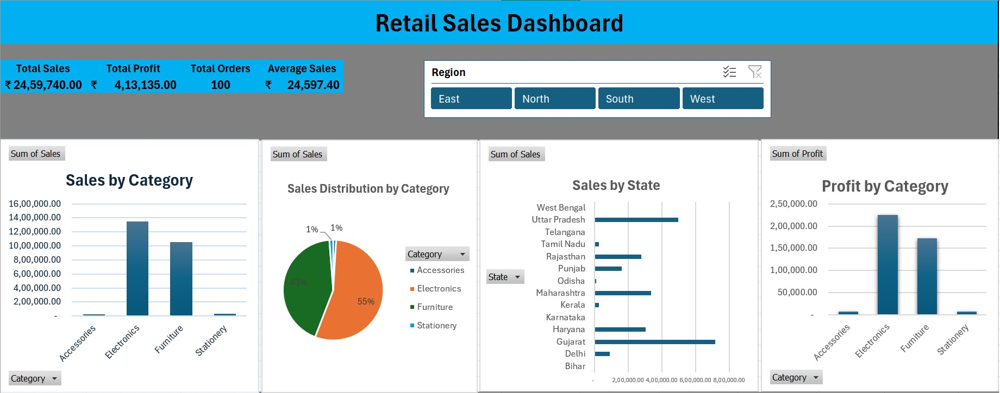

# Retail Sales Analysis (Excel)

## Project Overview
This project analyzes retail sales data using Microsoft Excel. It demonstrates data analysis techniques through formulas, pivot tables, charts, slicers, and an interactive dashboard.

## Features
- Data Cleaning
- Excel Formulas
- Pivot Tables
- Interactive Dashboard
- Charts & Visualizations
- Slicers for Region Filtering

## Excel Functions Used
- SUM
- AVERAGE
- IF
- SUMIF
- INDEX
- MATCH

## Dashboard Preview

## Files
- Retail_Sales_Analysis.xlsx – Excel project
- Dashboard.jpg – Dashboard preview

## Skills Demonstrated
- Microsoft Excel
- Data Analysis
- Data Visualization
- Dashboard Design
- Data Cleaning
